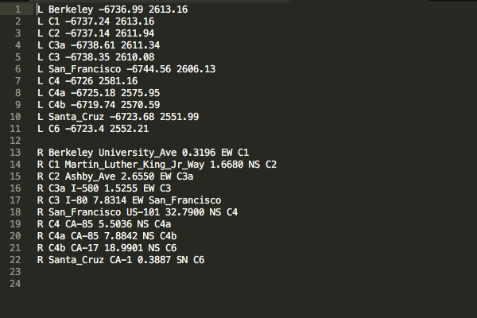
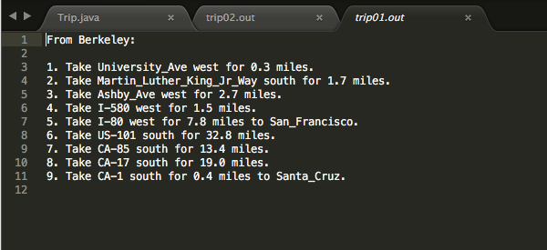
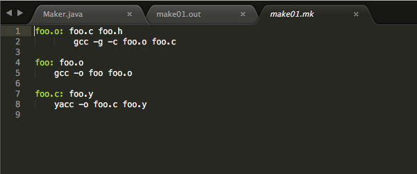
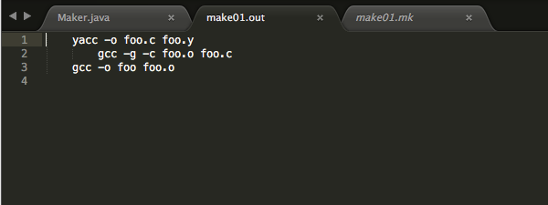

# Graph-API
One of my CS61B projects where I created a Graph API to implement a trip and a make client.
Makes use of directed and undirected graphs to run these clients. Both clients utilized implementations
of Djiktra's algorithm, Depth/Breadth First Search, and A * Traversal.

To run the trip client, use the command: `java trip.Main [ -m MAPFILE ] [ -o OUTFILE ] [ REQUESTFILE ]`  
For example,   `java trip.Main -m ../testing/trip/test.map -o ../testing/trip/test.out 'cat ../testing/trip/test.in' `  
would run find the shortest trip specified by the input locations in test.in and then output it in test.out.
Alternatively, you can simply write out the input locations (to, from, optional via locations), separated by spaces.

To run the make client, use the command: `java make [-D FILEINFO] [-f MAKEFILE] TARGET...`
For example,   `java -ea make.Main -f ../testing/make/test.mk -D ../testing.make/test.dir 'cat testing/make/test.in' `  
would run the make client on the specified files. Alternatively, you can simply write out the make command(s) to be run.
This client is primarily used for compiling and building Java applications.

=========================================

Trip Client Screenshots:

=========================================

Make Client Screenshots:

